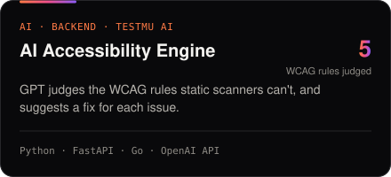
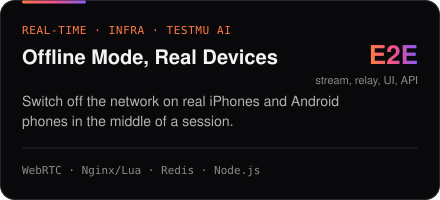
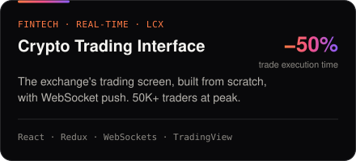
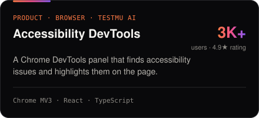

<picture>
  <source media="(prefers-color-scheme: dark)" srcset="assets/card-dark.svg" />
  <source media="(prefers-color-scheme: light)" srcset="assets/card-light.svg" />
  
</picture>

<h3>Hi, I'm Ravi 👋</h3>

Fullstack engineer, five years across developer tooling and fintech, mostly on the backend in Go, Python and Node.js. Most recently at TestMu AI (formerly LambdaTest): an AI accessibility engine on the OpenAI API, offline mode for real iOS and Android devices, and slow MySQL listings moved onto OpenSearch. Before that, the trading screen at LCX, a crypto exchange.

<h3>Selected work</h3>

<table>
<tr>
<td><a href="https://ravichaudhary.dev/work/ai-accessibility-engine">
<picture>
  <source media="(prefers-color-scheme: dark)" srcset="assets/work-ai-accessibility-engine-dark.svg" />
  <source media="(prefers-color-scheme: light)" srcset="assets/work-ai-accessibility-engine-light.svg" />
  
</picture>
</a></td>
<td><a href="https://ravichaudhary.dev/work/real-device-offline-mode">
<picture>
  <source media="(prefers-color-scheme: dark)" srcset="assets/work-real-device-offline-mode-dark.svg" />
  <source media="(prefers-color-scheme: light)" srcset="assets/work-real-device-offline-mode-light.svg" />
  
</picture>
</a></td>
</tr>
<tr>
<td><a href="https://ravichaudhary.dev/work/crypto-trading-interface">
<picture>
  <source media="(prefers-color-scheme: dark)" srcset="assets/work-crypto-trading-interface-dark.svg" />
  <source media="(prefers-color-scheme: light)" srcset="assets/work-crypto-trading-interface-light.svg" />
  
</picture>
</a></td>
<td><a href="https://ravichaudhary.dev/work/accessibility-devtools">
<picture>
  <source media="(prefers-color-scheme: dark)" srcset="assets/work-accessibility-devtools-dark.svg" />
  <source media="(prefers-color-scheme: light)" srcset="assets/work-accessibility-devtools-light.svg" />
  
</picture>
</a></td>
</tr>
</table>

Full case studies, with architecture diagrams, at <a href="https://ravichaudhary.dev">ravichaudhary.dev</a>

  

