<table>
<tr>
<td width="50%" align="center">
<picture>
  <source media="(prefers-color-scheme: dark)" srcset="assets/doodle-dark.png" />
  <source media="(prefers-color-scheme: light)" srcset="assets/doodle-light.png" />
  
</picture>
</td>
<td width="50%" align="center">
<picture>
  <source media="(prefers-color-scheme: dark)" srcset="assets/card-dark.svg" />
  <source media="(prefers-color-scheme: light)" srcset="assets/card-light.svg" />
  
</picture>
</td>
</tr>
</table>

<h3>Hi, I'm Ravi 👋</h3>

Fullstack engineer, five years across developer tooling and fintech, mostly on the backend in Go, Python and Node.js. Most recently at TestMu AI (formerly LambdaTest): an AI accessibility engine on the OpenAI API, offline mode for real iOS and Android devices, and slow MySQL listings moved onto OpenSearch. Before that, the trading screen at LCX, a crypto exchange.

